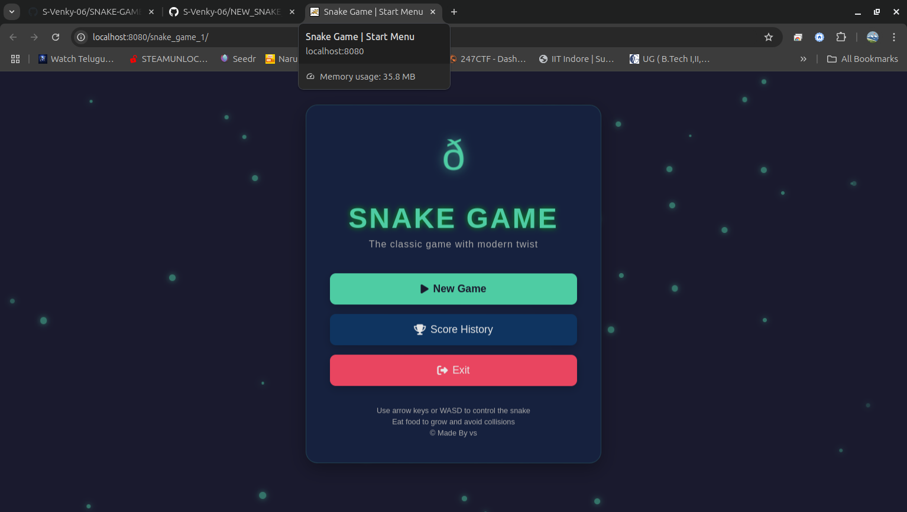
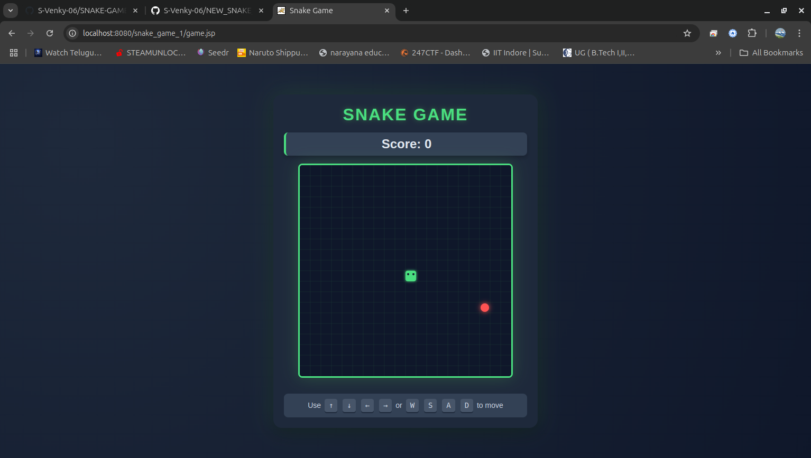
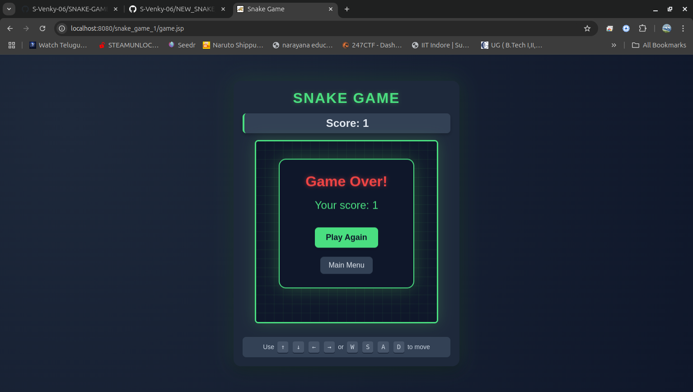
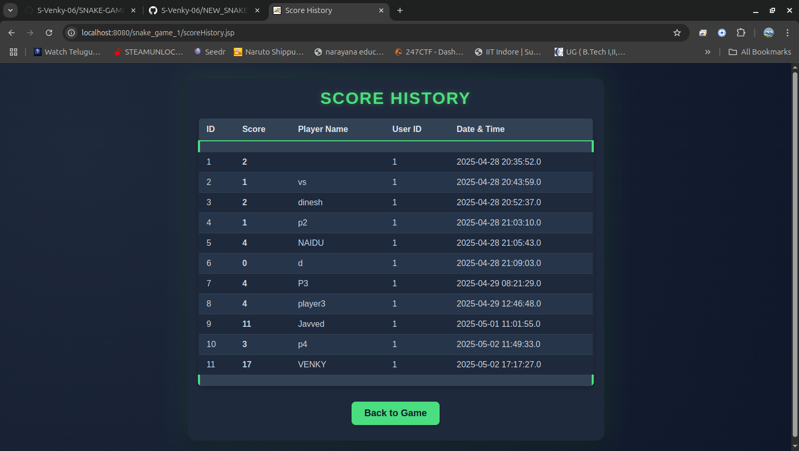

# Snake Game

## Description
This repository contains the source code for a modern take on the classic Snake Game. The game is built using web technologies and can be played directly in the browser.

## Features
- Classic Snake Game mechanics with a modern interface.
- Control the snake using arrow keys or WASD.
- Eat food to grow and avoid collisions.
- Track your score history.

## Interface
The game interface includes the following elements:
- **Title**: "SNAKE GAME" with the tagline "The classic game with a modern twist."
- **Buttons**:
  - "New Game" button to start a new game.
  - "Score History" button to view past scores.
  - "Exit" button to close the game.
- **Instructions**: "Use arrow keys or WASD to control the snake. Eat food to grow and avoid collisions."
- **Credits**: "Made by vs (myself)."

## Important Notes
- The **Score History** option requires a custom database setup.
- The game relies on JSP files, which require a server such as **Tomcat** to run.
- Run `index.jsp` as the main menu interface.

## Screenshots
Here’s how the game interface looks:

## New Game

## End Game

## Score History

## Author
- vs

